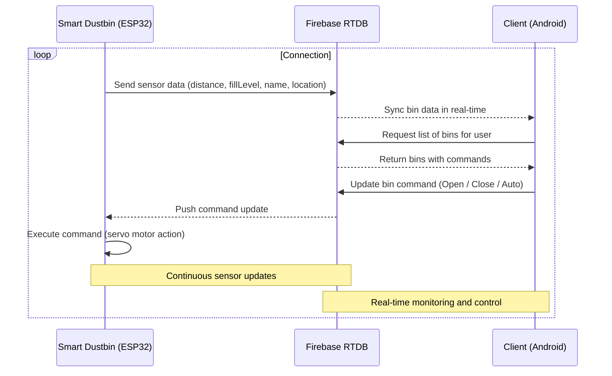

# Smart Dustbin -- ESP32 Firmware

A simple IoT-based smart trash bin powered by ESP32. The firmware controls sensors and actuators, syncs data to cloud (Firebase), and enables real-time monitoring via the companion Android app.

Technology Stack

|    Component    | Description                           |
|:---------------:| ------------------------------------- |
| Microcontroller | ESP32 (PlatformIO)                   |
|     Sensor      | Ultrasonic (HC-SR04) / IR sensor     | 
|    Actuator     | Servo motor                           |
| Cloud Platform  | Firebase (Realtime DB, FCM) |

## Transmission between ESP32, client, and cloud

## Related Projects

- Companion Android app: [Smart Dustbin -- Android App](https://github.com/radleigh123/smart-dustbin)
