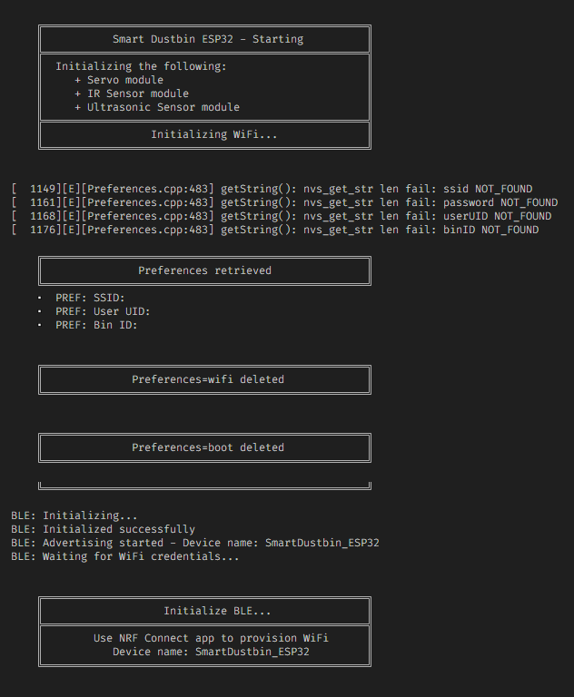
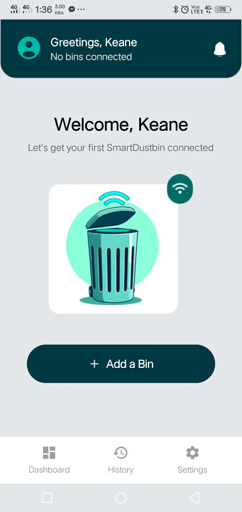
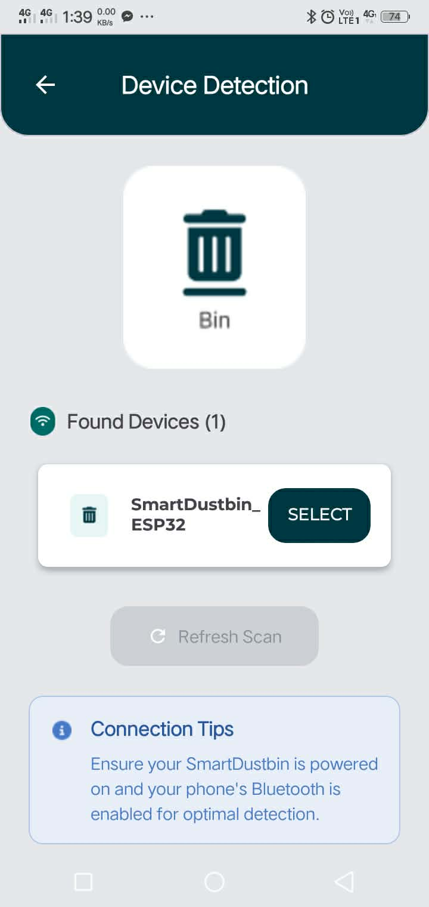
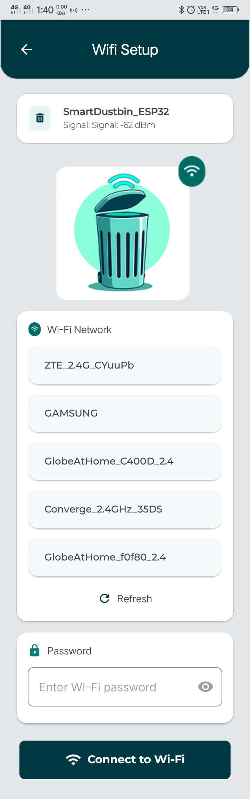
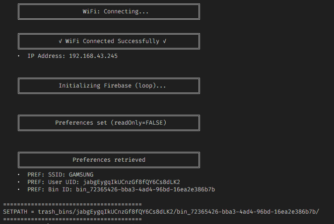
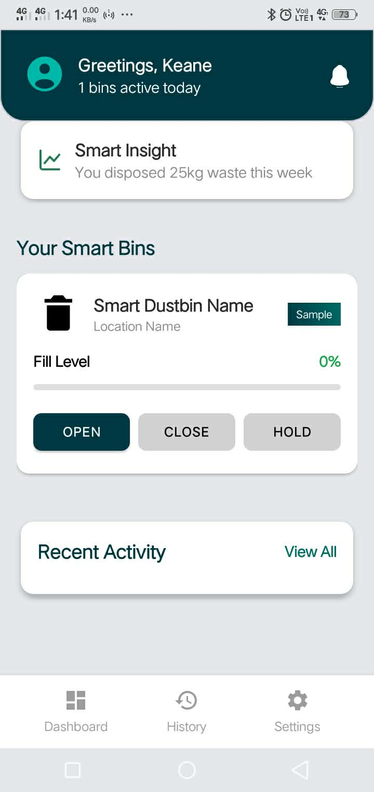

# Smart Dustbin Onboarding Guide

This will explain on how the mobile client application links with a Smart Dustbin device (ESP32) for the first time. The onboarding process uses Bluetooth Low Energy (BLE) to transfer Wi-Fi credentials and ownership information (`userId` + `binId`). Once provisioned, the ESP32 communicates with Firebase Realtime Database (RTDB) for live monitoring.

## 1. ESP32 Initial Boot Sequence

When the ESP32 powers on for the very first time (or after a factory reset), it performs the following initialization steps in order:

- Module initializations:
 	- Servo motor
 	- Ultrasonic sensors
 	- IR sensor
- Preference lookups, ESP32 checks for stored:
 	- `ssid`
 	- `password`
 	- `userId`
 	- `binId`
- BLE Server initializations, ESP32 starts a BLE GATT server that exposes:
 	- Receiving Wi-Fi SSID
 	- Receiving Wi-Fi Password
 	- Receiving `userId` & `binId`
 	- Writing to preferences

## 2. Client App - Empty Dashboard

### When “Add Bin” Is Clicked

1. The app opens the BLE-scanning screen.
2. Mobile device begins scanning for ESP32 dustbins broadcasting the predefined BLE service UUID.
3. Once detected, devices appear in a list.

## 3. Select an ESP32 Device (BLE Scan)

Each entry displays:

- Device Name (e.g., _SmartDustbin-XXXX_)
- MAC Address
- Signal Strength (optional)

Selecting a device initiates the Wi-Fi provisioning flow.

> **BLE Provisioning Overview**
> It is the process of securely transmitting Wi-Fi credentials and metadata from the mobile app to the ESP32 before it connects to the internet.
> During provisioning, the client app sends:
>
> - `ssid`
> - `password`
> - `userId`
> - `binId`
>
> The ESP32 stores these in its non-volatile memory (Preferences), allowing it to auto-connect on every boot.

## 4. Wi-Fi Selection & Credential Input

### When the User Clicks **“Connect to Wi-Fi”**

1. App transmits SSID, Password, `userId`, and `binId` over BLE.
2. ESP32 writes these values to Preferences.
3. BLE sends back a status response.
4. ESP32 immediately attempts to connect to the selected Wi-Fi network.

## 5. ESP32 After Provisioning Success

Once Wi-Fi connection is successful, the ESP32 logs `_WiFi Connected_` and then the device retrieves the assigned IP address.  Firebase RTDB sync routines begin (initializing listeners, uploading bin state, etc.)

This confirmation ensures the dustbin is officially linked to the user’s account and ready for cloud communication.

## 6. Final - Dustbin Added

After successful provisioning, the user is redirected back to the main dashboard. From this point onward, the device communicates with Firebase RTDB and will no longer require BLE unless reconfigured. Even if its Wi-Fi connections get lost, it will constantly try to reconnect based on the saved preferences (`ssid` & `password`).
